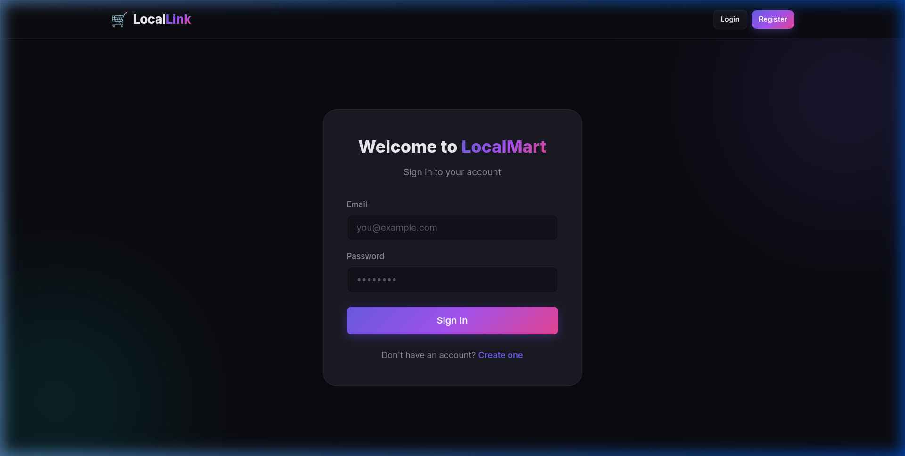
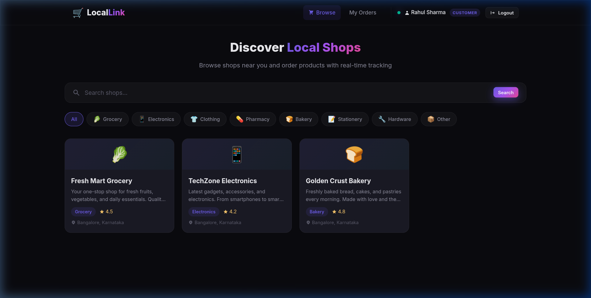
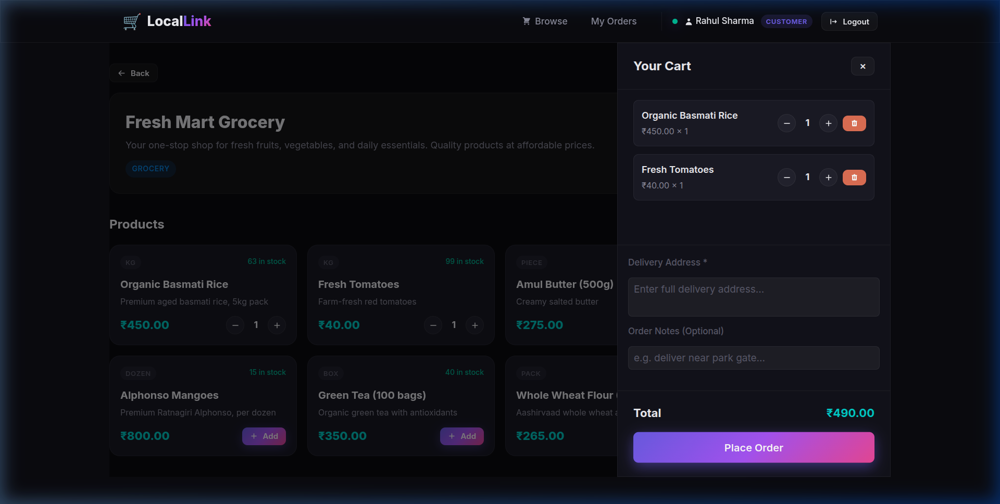
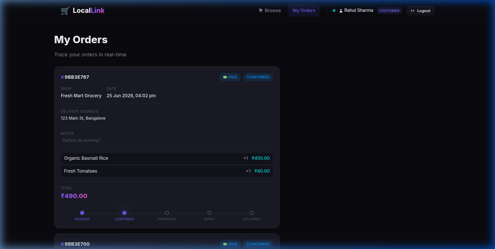
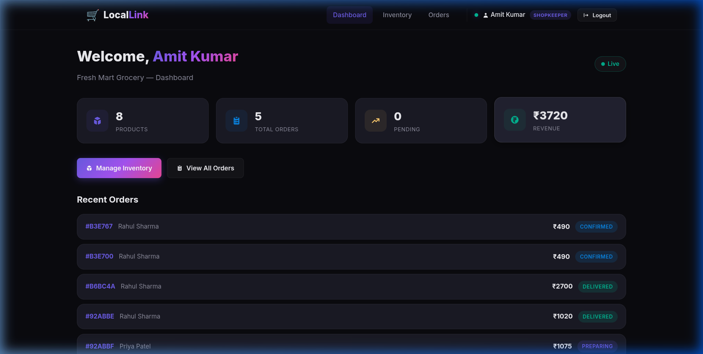
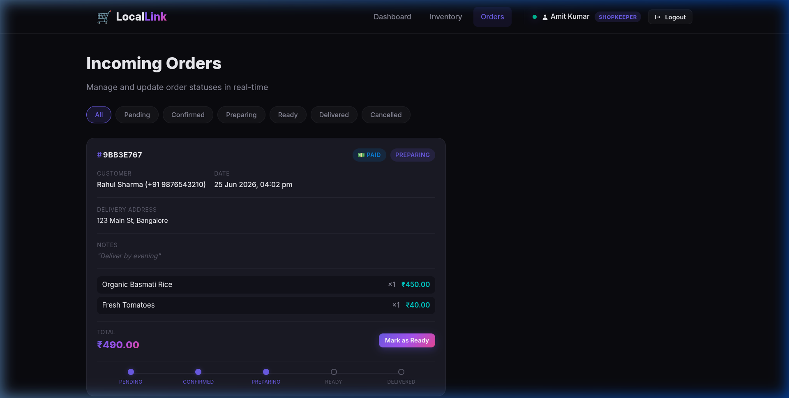

# 🛒 Local Link — Real-Time Local Mart Commerce App

**Local Link** is a modern, full-stack MERN (MongoDB, Express, React, Node.js) application that empowers local commerce through real-time order tracking and store-level inventory management. 

Featuring a dual-portal interface tailored separately for **Customers** and **Shopkeepers**, Local Link delivers low-latency notifications, stateless role-based authentication, and a secure payment checkout gateway.

---

## ✨ Features

### 👤 Customer Portal
- **Browse Stores**: Find local shops by category (Grocery, Electronics, Bakery, Pharmacy, etc.).
- **Product Catalog**: Live product availability and stock indicators.
- **Cart Management**: Add items, adjust quantities, and supply custom delivery addresses or order notes.
- **Razorpay Checkout**: Seamless payment gateway integration (supports standard checkout and local test-mode simulations).
- **Real-Time Order Tracking**: Visual progress bar tracking order statuses (Pending ➔ Confirmed ➔ Preparing ➔ Ready ➔ Delivered) as they are updated by shopkeepers.

### 🏪 Shopkeeper Dashboard
- **Store Performance Stats**: Instant high-level summary cards showing total revenue, pending orders, and total active inventory items.
- **Inventory Control**: Full CRUD operations to add, edit, or delete store products (automatically tracks unit sizes, prices, and stock counts).
- **Real-Time Orders Feed**: Dynamically receives incoming orders with zero-refresh using WebSocket rooms.
- **Instant Status Transitions**: One-click updates to advance order milestones and notify clients instantly.

---

## 📸 Application Screenshots

### 🔑 Authentication


### 👤 Customer Portal
| 🏪 Shop Browsing | 🛒 Cart & Checkout (Razorpay) |
| :---: | :---: |
|  |  |

| 📦 Live Order Progress |
| :---: |
|  |

### 🏪 Shopkeeper Portal
| 📊 Performance Stats | 🔔 Real-Time Order Management |
| :---: | :---: |
|  |  |

---

## 🛠️ Tech Stack & Architecture

- **Backend**: Node.js & Express.js (Model-View-Controller pattern).
- **Database**: MongoDB & Mongoose.
  - **Performance Optimization**: Implemented a **compound index `{ shop: 1, order_status: 1 }`** on the `Order` schema to ensure highly performant queries during dashboard updates.
- **Real-Time**: Socket.IO (Server & Client integration).
  - **Targeted Rooms**: Clients auto-join custom rooms (`shop:<shop_id>` and `user:<user_id>`) so order alerts are isolated and secure.
- **Authentication**: Stateless JSON Web Tokens (JWT) with custom Role-Based Access Control (RBAC) middleware.
- **Payments**: Razorpay SDK (with automatic fallback to **Simulated Payment Mode** for testing environments where API keys are placeholders).
- **Frontend**: React.js (Vite), React Router, Axios, Context API, React Hot Toast, React Icons.
- **Styling**: Premium dark-themed design system featuring CSS glassmorphism, tailored gradients, and responsive layouts.

---

## 📂 Project Structure

```
Local_Link/
├── server/                              # Node.js + Express backend
│   ├── config/db.js                     # MongoDB connection setup
│   ├── models/                          # Database schemas
│   │   ├── User.js                      # Password bcrypt hashing & roles
│   │   ├── Shop.js                      # Store metadata
│   │   ├── Product.js                   # Inventory tracking
│   │   └── Order.js                     # Indexed order transactions
│   ├── controllers/                     # MVC business logic
│   │   ├── authController.js
│   │   ├── shopController.js
│   │   ├── productController.js
│   │   ├── orderController.js
│   │   └── paymentController.js         # Razorpay checkout & signature checks
│   ├── middleware/                      # Auth guards & global error handlers
│   ├── routes/                          # API routing
│   ├── socket/socketHandler.js          # Socket.IO room management
│   ├── seed.js                          # Database seed utility script
│   └── server.js                        # HTTP & WebSocket server entry point
│
├── client/                              # React + Vite frontend
│   ├── public/
│   ├── src/
│   │   ├── components/                  # Reusable UI components (Navbar, OrderCard)
│   │   ├── context/                     # State providers (AuthContext, SocketContext)
│   │   ├── pages/                       # Portal screens
│   │   │   ├── Auth/Login/Register
│   │   │   ├── customer/                # Customer browse & checkout
│   │   │   └── shopkeeper/              # Inventory & orders control dashboards
│   │   ├── services/api.js               # Central Axios configuration with JWT interceptor
│   │   ├── App.jsx                      # App router configuration
│   │   └── index.css                     # Dark-mode design system & variables
│   └── index.html                       # Base HTML (includes Razorpay checkout script)
```

---

## ⚡ Quick Start

### Prerequisites
- [Node.js](https://nodejs.org/) (v16+ recommended)
- [MongoDB](https://www.mongodb.com/) (Local instance or MongoDB Atlas cluster connection string)

### 1. Clone & Install Dependencies

```bash
git clone https://github.com/SunnyKumar28/Local_Link.git
cd Local_Link

# Install backend dependencies
cd server && npm install

# Install frontend dependencies
cd ../client && npm install
```

### 2. Configure Environment Variables

Create a `.env` file in the `server` directory based on the `.env.example` file:

```env
PORT=5000
MONGO_URI=mongodb://localhost:27017/local_mart
JWT_SECRET=your_super_secret_jwt_key
JWT_EXPIRES_IN=7d
CLIENT_URL=http://localhost:5173

# Razorpay Keys (Leave as placeholders to use the Mock Payment Simulator)
RAZORPAY_KEY_ID=rzp_test_YourTestKeyHere
RAZORPAY_KEY_SECRET=YourTestSecretHere
```

### 3. Seed the Database

Populate your database with sample shops, products, and default accounts:

```bash
cd server
npm run seed
```

Once seeded, you can log in using these demo credentials:
- **Customer**: `customer@localmart.com` / `password123`
- **Shopkeeper**: `shopkeeper@localmart.com` / `password123`

### 4. Start the Application

Open two separate terminals:

**Terminal 1 (Backend Server)**:
```bash
cd server
npm run dev
```

**Terminal 2 (Frontend Client)**:
```bash
cd client
npm run dev
```

Visit the app at `http://localhost:5173`.

---

## 🔗 Key API Reference

| Endpoint | Method | Access | Description |
| :--- | :---: | :---: | :--- |
| `/api/auth/register` | `POST` | Public | Register a new user (Customer or Shopkeeper) |
| `/api/auth/login` | `POST` | Public | Authenticate user & return JWT token |
| `/api/shops` | `GET` | Private | Retrieve all active stores |
| `/api/products/shop/:shopId`| `GET` | Private | Get products belonging to a shop |
| `/api/orders` | `POST` | Private (Cust) | Place order (direct COD route) |
| `/api/payments/create-order` | `POST` | Private (Cust) | Prepare order transaction & Razorpay order ID |
| `/api/payments/verify` | `POST` | Private (Cust) | Verify signature, deduct stocks, & confirm order |
| `/api/orders/shop` | `GET` | Private (Shop) | Fetch incoming orders for shopkeeper (indexed) |
| `/api/orders/:id/status` | `PUT` | Private (Shop) | Update order stage & notify user via Socket.IO |
